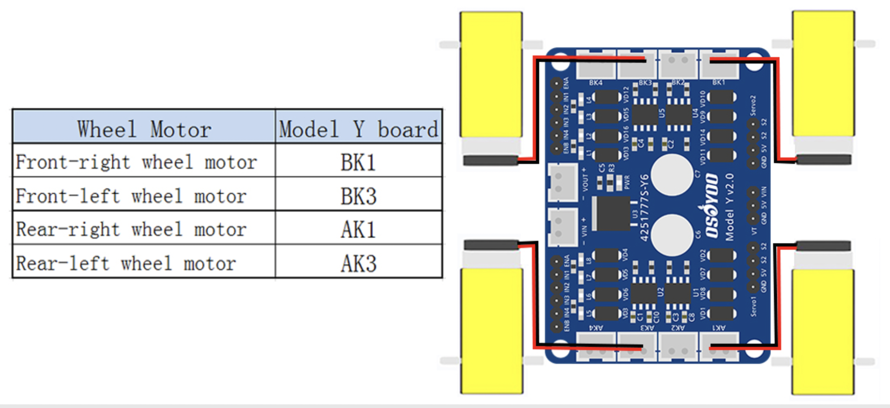
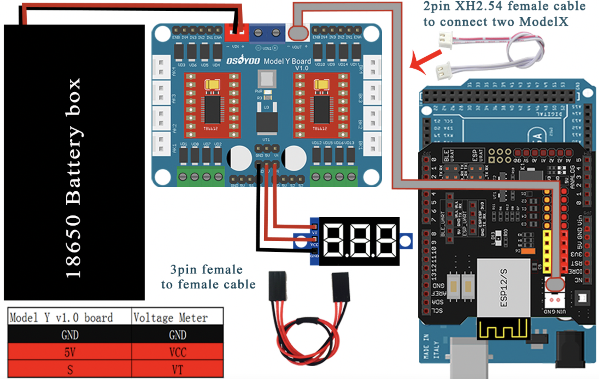
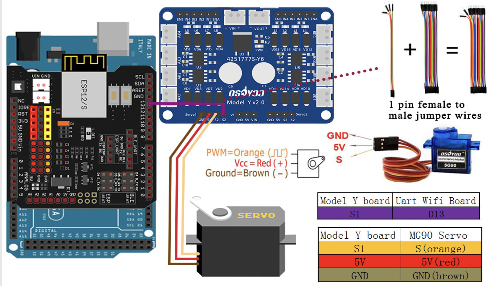

# Mecanum/Omniwheel Delivery Robot
Replace this text with a brief description (2-3 sentences) of your project. This description should draw the reader in and make them interested in what you've built. You can include what the biggest challenges, takeaways, and triumphs from completing the project were. As you complete your portfolio, remember your audience is less familiar than you are with all that your project entails!

| **Engineer** | **School** | **Area of Interest** | **Grade** |
|:--:|:--:|:--:|:--:|
| Alex P | Kehilah Jewish High School | Computer Science and Engineering | Incoming Freshman

**Replace the BlueStamp logo below with an image of yourself and your completed project. Follow the guide [here](https://tomcam.github.io/least-github-pages/adding-images-github-pages-site.html) if you need help.**


  
# Final Milestone
For your final milestone, explain the outcome of your project. Key details to include are:
- What you've accomplished since your previous milestone
- What your biggest challenges and triumphs were at BSE
- A summary of key topics you learned about
- What you hope to learn in the future after everything you've learned at BSE

**Don't forget to replace the text below with the embedding for your milestone video. Go to Youtube, click Share -> Embed, and copy and paste the code to replace what's below.**

<iframe width="560" height="315" src="https://www.youtube.com/embed/F7M7imOVGug" title="YouTube video player" frameborder="0" allow="accelerometer; autoplay; clipboard-write; encrypted-media; gyroscope; picture-in-picture; web-share" allowfullscreen></iframe>

# Second Milestone
For your second milestone, explain what you've worked on since your previous milestone. You can highlight:
- Technical details of what you've accomplished and how they contribute to the final goal
- What has been surprising about the project so far
- Previous challenges you faced that you overcame
- What needs to be completed before your final milestone 

**Don't forget to replace the text below with the embedding for your milestone video. Go to Youtube, click Share -> Embed, and copy and paste the code to replace what's below.**

<iframe width="560" height="315" src="https://www.youtube.com/embed/y3VAmNlER5Y" title="YouTube video player" frameborder="0" allow="accelerometer; autoplay; clipboard-write; encrypted-media; gyroscope; picture-in-picture; web-share" allowfullscreen></iframe>

# First Milestone
For your first milestone, describe what your project is and how you plan to build it. You can include:
- An explanation about the different components of your project and how they will all integrate together
- Technical progress you've made so far
- Challenges you're facing and solving in your future milestones
- What your plan is to complete your project

**Don't forget to replace the text below with the embedding for your milestone video. Go to Youtube, click Share -> Embed, and copy and paste the code to replace what's below.**

<iframe width="560" height="315" src="https://www.youtube.com/embed/6ndPc5qHybc" title="YouTube video player" frameborder="0" allow="accelerometer; autoplay; clipboard-write; encrypted-media; gyroscope; picture-in-picture; web-share" allowfullscreen></iframe>

# Schematics 
Here's where you'll put images of your schematics. [Tinkercad](https://www.tinkercad.com/blog/official-guide-to-tinkercad-circuits) and [Fritzing](https://fritzing.org/learning/) are both great resoruces to create professional schematic diagrams, though BSE recommends Tinkercad becuase it can be done easily and for free in the browser. 





# Code
Here's where you'll put your code. The syntax below places it into a block of code. Follow the guide [here]([url](https://www.markdownguide.org/extended-syntax/)) to learn how to customize it to your project needs. 

```c++
#define SPEED 200    
#define TURN_SPEED 200    
#define speedPinR 9   //  Front Wheel PWM pin connect Model-Y M_B ENA 
#define RightMotorDirPin1  22    //Front Right Motor direction pin 1 to Model-Y M_B IN1  (K1)
#define RightMotorDirPin2  24   //Front Right Motor direction pin 2 to Model-Y M_B IN2   (K1)                                 
#define LeftMotorDirPin1  26    //Front Left Motor direction pin 1 to Model-Y M_B IN3 (K3)
#define LeftMotorDirPin2  28   //Front Left Motor direction pin 2 to Model-Y M_B IN4 (K3)
#define speedPinL 10   //  Front Wheel PWM pin connect Model-Y M_B ENB

#define speedPinRB 11   //  Rear Wheel PWM pin connect Left Model-Y M_A ENA 
#define RightMotorDirPin1B  5    //Rear Right Motor direction pin 1 to Model-Y M_A IN1 ( K1)
#define RightMotorDirPin2B 6    //Rear Right Motor direction pin 2 to Model-Y M_A IN2 ( K1) 
#define LeftMotorDirPin1B 7    //Rear Left Motor direction pin 1 to Model-Y M_A IN3  (K3)
#define LeftMotorDirPin2B 8  //Rear Left Motor direction pin 2 to Model-Y M_A IN4 (K3)
#define speedPinLB 12    //  Rear Wheel PWM pin connect Model-Y M_A ENB

/*motor control*/
void go_advance(int speed){
   RL_fwd(speed);
   RR_fwd(speed);
   FR_fwd(speed);
   FL_fwd(speed); 
}
void go_back(int speed){
   RL_bck(speed);
   RR_bck(speed);
   FR_bck(speed);
   FL_bck(speed); 
}
void right_shift(int speed_fl_fwd,int speed_rl_bck ,int speed_rr_fwd,int speed_fr_bck) {
  FL_fwd(speed_fl_fwd); 
  RL_bck(speed_rl_bck); 
  RR_fwd(speed_rr_fwd);
  FR_bck(speed_fr_bck);
}
void left_shift(int speed_fl_bck,int speed_rl_fwd ,int speed_rr_bck,int speed_fr_fwd){
   FL_bck(speed_fl_bck);
   RL_fwd(speed_rl_fwd);
   RR_bck(speed_rr_bck);
   FR_fwd(speed_fr_fwd);
}

void left_turn(int speed){
   RL_bck(0);
   RR_fwd(speed);
   FR_fwd(speed);
   FL_bck(0); 
}
void right_turn(int speed){
 //  RL_fwd(speed);
//   RR_bck(0);
 //  FR_bck(0);
 //  FL_fwd(speed); 

   RL_fwd(speed);
   RR_fwd(0);
   FR_fwd(0);
   FL_fwd(speed); 
}
void left_back(int speed){
   RL_fwd(0);
   RR_bck(speed);
   FR_bck(speed);
   FL_fwd(0); 
}
void right_back(int speed){
   RL_bck(speed);
   RR_fwd(0);
   FR_fwd(0);
   FL_bck(speed); 
}
void clockwise(int speed){
   RL_fwd(speed);
   RR_bck(speed);
   FR_bck(speed);
   FL_fwd(speed); 
}
void countclockwise(int speed){
   RL_bck(speed);
   RR_fwd(speed);
   FR_fwd(speed);
   FL_bck(speed); 
}


void FR_fwd(int speed)  //front-right wheel forward turn
{
  digitalWrite(RightMotorDirPin1,HIGH);
  digitalWrite(RightMotorDirPin2,LOW); 
  analogWrite(speedPinR,speed);
}
void FR_bck(int speed) // front-right wheel backward turn
{
  digitalWrite(RightMotorDirPin1,LOW);
  digitalWrite(RightMotorDirPin2,HIGH); 
  analogWrite(speedPinR,speed);
}
void FL_fwd(int speed) // front-left wheel forward turn
{
  digitalWrite(LeftMotorDirPin1,HIGH);
  digitalWrite(LeftMotorDirPin2,LOW);
  analogWrite(speedPinL,speed);
}
void FL_bck(int speed) // front-left wheel backward turn
{
  digitalWrite(LeftMotorDirPin1,LOW);
  digitalWrite(LeftMotorDirPin2,HIGH);
  analogWrite(speedPinL,speed);
}

void RR_fwd(int speed)  //rear-right wheel forward turn
{
  digitalWrite(RightMotorDirPin1B, HIGH);
  digitalWrite(RightMotorDirPin2B,LOW); 
  analogWrite(speedPinRB,speed);
}
void RR_bck(int speed)  //rear-right wheel backward turn
{
  digitalWrite(RightMotorDirPin1B, LOW);
  digitalWrite(RightMotorDirPin2B,HIGH); 
  analogWrite(speedPinRB,speed);
}
void RL_fwd(int speed)  //rear-left wheel forward turn
{
  digitalWrite(LeftMotorDirPin1B,HIGH);
  digitalWrite(LeftMotorDirPin2B,LOW);
  analogWrite(speedPinLB,speed);
}
void RL_bck(int speed)    //rear-left wheel backward turn
{
  digitalWrite(LeftMotorDirPin1B,LOW);
  digitalWrite(LeftMotorDirPin2B,HIGH);
  analogWrite(speedPinLB,speed);
}
 
void stop_Stop()    //Stop
{
  analogWrite(speedPinLB,0);
  analogWrite(speedPinRB,0);
  analogWrite(speedPinL,0);
  analogWrite(speedPinR,0);
}


//Pins initialize
void init_GPIO()
{
  pinMode(RightMotorDirPin1, OUTPUT); 
  pinMode(RightMotorDirPin2, OUTPUT); 
  pinMode(speedPinL, OUTPUT);  
 
  pinMode(LeftMotorDirPin1, OUTPUT);
  pinMode(LeftMotorDirPin2, OUTPUT); 
  pinMode(speedPinR, OUTPUT);
  pinMode(RightMotorDirPin1B, OUTPUT); 
  pinMode(RightMotorDirPin2B, OUTPUT); 
  pinMode(speedPinLB, OUTPUT);  
 
  pinMode(LeftMotorDirPin1B, OUTPUT);
  pinMode(LeftMotorDirPin2B, OUTPUT); 
  pinMode(speedPinRB, OUTPUT);
   
  stop_Stop();
}

void setup()
{
  init_GPIO();


go_advance(SPEED);
     delay(3000);
     stop_Stop();
     delay(1000);
  
go_back(SPEED);
      delay(3000);
      stop_Stop();
      delay(1000);

/*	  
left_turn(TURN_SPEED);
      delay(1000);
      stop_Stop();
      delay(1000);
	  
right_turn(TURN_SPEED);
     delay(1000);
     stop_Stop();
     delay(1000);
  
right_shift(200,200,200,200); //right shift
     delay(1000);
     stop_Stop();
     delay(1000);

left_shift(200,200,200,200); //left shift
     delay(1000);
     stop_Stop();
     delay(1000);
	 
left_shift(200,0,200,0); //left diagonal back
     delay(1000);
     stop_Stop();
	 delay(1000);
 
right_shift(200,0,200,0); //right diagonal ahead
     delay(1000);
     stop_Stop();
	 delay(1000);

left_shift(0,200,0,200); //left diagonal ahead
     delay(1000);
     stop_Stop();
     delay(1000);

right_shift(0,200,0,200); //right diagonal back
     delay(1000);
     stop_Stop();
	 delay(1000);

*/

}

void loop(){
}

```

# Bill of Materials
Here's where you'll list the parts in your project. To add more rows, just copy and paste the example rows below.
Don't forget to place the link of where to buy each component inside the quotation marks in the corresponding row after href =. Follow the guide [here]([url](https://www.markdownguide.org/extended-syntax/)) to learn how to customize this to your project needs. 

| **Part** | **Note** | **Price** | **Link** |
|:--:|:--:|:--:|:--:|
| Item Name | What the item is used for | $Price | <a> Link </a> |
|Arduino Mega and USB Cord|Used to interact with energy by using code|$20.99|<a> "https://www.amazon.com/ELEGOO-ATmega2560-ATMEGA16U2-Projects-Compliant/dp/B01H4ZLZLQ/ref=asc_df_B01H4ZLZLQ/?tag=hyprod-20&linkCode=df0&hvadid=309743296044&hvpos=&hvnetw=g&hvrand=12310535526926751668&hvpone=&hvptwo=&hvqmt=&hvdev=c&hvdvcmdl=&hvlocint=&hvlocphy=9031968&hvtargid=pla-490931309987&th=1" </a> |
| Mecanum Wheels| These are the wheels of the robot | $29.99 |https://www.amazon.com/Omni-Directional-Hardness-Intelligent-Components-Accessories/dp/B096HWF3S9)|
|Amazon AA Batteries|Used to power the vedichle|$9.29|(https://www.amazon.com/AmazonBasics-Performance-Alkaline-Batteries-12-Pack/dp/B07KWYGTC6)|
| Osoyoo IR Transmitters | IR Transmission | $9.96 |https://www.amazon.com/OSOYOO-Infrared-Obstacle-Avoidance-Arduino/dp/B01I57HIJ0?ref_=ast_sto_dp|
|OSOYOO Infrared Line Tracking Sensor Module|Reflection Tracking|$9.99|https://www.amazon.com/OSOYOO-5-Line-Tracking-Sensor-Female/dp/B091BRVBXD?ref_=ast_sto_dp|
|Wires|These aren't the exact wires I used but they are the closest ones I can find.|$9.99|https://www.amazon.com/Elegoo-EL-CP-004-Multicolored-Breadboard-arduino/dp/B01EV70C78/ref=sr_1_1_sspa?crid=3RA9E5VC4FLUM&keywords=female%2Bwires&qid=1687376818&sprefix=female%2Bwire%2Caps%2C196&sr=8-1-spons&sp_csd=d2lkZ2V0TmFtZT1zcF9hdGY&th=1|
|Battery Pack|Holds the AA batteries|$6.48|https://www.amazon.com/LAMPVPATH-Battery-Holder-Leads-Wires/dp/B07T7MTRZX/ref=sr_1_3?crid=IVV96333EFPX&keywords=4+AA+Battery+Holder&qid=1687377014&s=electronics&sprefix=%2Celectronics%2C144&sr=1-3|
|Gear Motor Dual Shaft 3-6V L Shape TT Motor|Turns the wheels|$8.99|https://www.amazon.com/Antrader-Motor-Shaft-Arduino-Smart/dp/B07S6NFNWZ/ref=sr_1_36?keywords=motors&qid=1687377100&sr=8-36&th=1|
|Voltage Meter|Displays the voltage|$9.99|https://www.amazon.com/RuiLing-Digital-Voltmeter-Electromobile-Motorcycle/dp/B07THN5TRS/ref=sr_1_3_sspa?crid=Q2WW1B12PKDH&keywords=1+voltage+meter&qid=1687377330&sprefix=1+voltage+meter%2Caps%2C145&sr=8-3-spons&sp_csd=d2lkZ2V0TmFtZT1zcF9hdGY&psc=1|
|Servo Motor|rotate and push parts with precision|$10.16|https://www.amazon.com/Servo-Motors-Sub-Micro-SG51R-piece/dp/B0137LG0KW/ref=sr_1_1_sspa?crid=32UA5D9177IHH&keywords=servo+motor&qid=1687377605&sprefix=servo+moto%2Caps%2C160&sr=8-1-spons&sp_csd=d2lkZ2V0TmFtZT1zcF9hdGY&psc=1&smid=AM0JQO74J587C|
|OSOYOO ESP8266 WiFi shield|Allows an Arduino board to connect to the internet using the WiFi library and to read and write an SD card using the SD library|N/A|N/A|
# Other Resources/Examples
One of the best parts about Github is that you can view how other people set up their own work. Here are some past BSE portfolios that are awesome examples. You can view how they set up their portfolio, and you can view their index.md files to understand how they implemented different portfolio components.
- [Example 1](https://trashytuber.github.io/YimingJiaBlueStamp/)
- [Example 2](https://sviatil0.github.io/Sviatoslav_BSE/)
- [Example 3](https://arneshkumar.github.io/arneshbluestamp/)

To watch the BSE tutorial on how to create a portfolio, click here.
